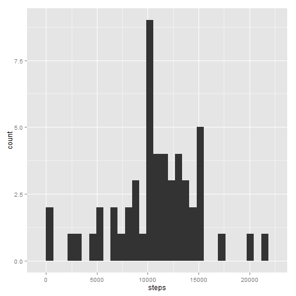
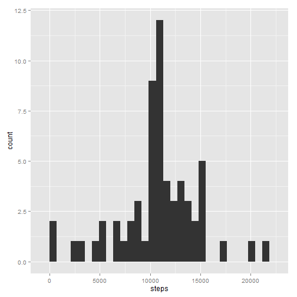

# Reproducible Research: Peer Assessment 1


## Loading and preprocessing the data


```r
if (!file.exists("activity.csv")) {
  unzip("activity.zip")
}

activity <- read.csv("activity.csv")
```


## What is mean total number of steps taken per day?

First we make a histogram of the total number of steps taken per day. Next, we
calculate the summary of the total number of steps taken per day to find what is
its mean and median.


```r
library(ggplot2)
ggplot(aggregate(steps ~ date, activity, FUN=sum)) + aes(x=steps) + geom_histogram()
```

```
## stat_bin: binwidth defaulted to range/30. Use 'binwidth = x' to adjust this.
```

 

```r
summary((aggregate(steps ~ date, activity, FUN=sum)$steps))
```

```
##    Min. 1st Qu.  Median    Mean 3rd Qu.    Max. 
##      41    8840   10800   10800   13300   21200
```


## What is the average daily activity pattern?

Here, we plot the average daily pattern, calculating the mean number of steps
taken per interval, across all days. Next, we find which interval has the
highest average.


```r
ggplot(aggregate(steps ~ interval, activity, FUN=mean)) + aes(x=interval, y=steps) +
  geom_line()
```

 

```r
avg_activity <- aggregate(steps ~ interval, activity, FUN=mean)
avg_activity[order(avg_activity$steps, decreasing = T),][1,]
```

```
##     interval steps
## 104      835 206.2
```


## Imputing missing values

In this section, we calculate the number of missing values for the variables of
the dataset. Then, we replace those missing values with the average of the
number of steps across all days for the corresponding interval. Next, we
recreate the histogram and recalculate the mean and median total number of
steps per day.


```r
sapply(activity, FUN=function(x) sum(is.na(x)))
```

```
##    steps     date interval 
##     2304        0        0
```

```r
activity_f <- merge(activity, avg_activity, by="interval", all.x=T)
colnames(activity_f) <- c("interval", "steps", "date", "average")
activity_f$steps <- ifelse(is.na(activity_f$steps), activity_f$average, activity_f$steps)
activity_f$average <- NULL

ggplot(aggregate(steps ~ date, activity_f, FUN=sum)) + aes(x=steps) + geom_histogram()
```

```
## stat_bin: binwidth defaulted to range/30. Use 'binwidth = x' to adjust this.
```

 

```r
summary((aggregate(steps ~ date, activity_f, FUN=sum)$steps))
```

```
##    Min. 1st Qu.  Median    Mean 3rd Qu.    Max. 
##      41    9820   10800   10800   12800   21200
```


## Are there differences in activity patterns between weekdays and weekends?

Using the new dataset, without missing values, we create a factor variable
indicating whether it is weekday or weekend, and, using the lattice package,
plot the average daily pattern across this two categories.


```r
# weekday abbreviated name (in locale language)
activity_f$day_of_week <- weekdays(as.Date(as.character(activity_f$date)), abbreviate = T)

# weekday = 1, weekend = 2
activity_f$weekday <- 1 + activity_f$day_of_week %in% c("dom", "sáb")
activity_f$weekday <- factor(activity_f$weekday, labels=c("weekday", "weekend"))

library(lattice)

xyplot(steps ~ interval | weekday,
       data=aggregate(steps ~ interval + weekday, data=activity_f, FUN=mean),
       type="l", layout=c(1,2))
```

 
